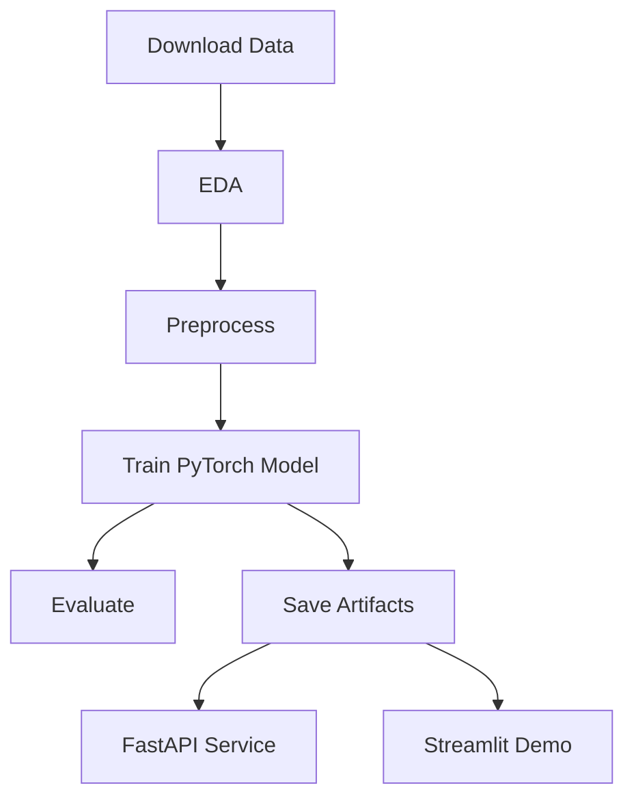

# Tabular ML Lab

End-to-end tabular ML pipeline in **PyTorch**: download data, run EDA, train a model, evaluate, serve an API, and launch a demo dashboard.

## Highlights
- Reproducible training pipeline with early stopping
- Strong preprocessing: imputation + scaling + one-hot encoding
- Evaluation with ROC/PR curves and a detailed report
- FastAPI inference service
- Streamlit demo UI

## Quickstart
```bash
python -m venv .venv
source .venv/bin/activate
pip install -r requirements.txt

python scripts/download_data.py
python scripts/eda.py
python scripts/train.py
python scripts/evaluate.py
```

## Serve the API
```bash
python scripts/serve.py
```

Example request:
```bash
curl -X POST http://localhost:8000/predict \
  -H "Content-Type: application/json" \
  -d '{
    "age": 39,
    "workclass": "State-gov",
    "fnlwgt": 77516,
    "education": "Bachelors",
    "education-num": 13,
    "marital-status": "Never-married",
    "occupation": "Adm-clerical",
    "relationship": "Not-in-family",
    "race": "White",
    "sex": "Male",
    "capital-gain": 2174,
    "capital-loss": 0,
    "hours-per-week": 40,
    "native-country": "United-States"
  }'
```

## Launch the Dashboard
```bash
python scripts/dashboard.py
```

## Architecture


## Project Structure
```
app/                # FastAPI + Streamlit apps
configs/            # YAML configuration
scripts/            # Entry points for pipeline steps
src/tabular_ml_lab/ # Core library
reports/            # Metrics and plots (generated)
models/             # Saved model artifacts (generated)
```

## Dataset
This project uses the **UCI Adult** dataset for income classification (`>50K` vs `<=50K`).

- Source: [UCI Adult](https://archive.ics.uci.edu/ml/datasets/Adult)
- Target: `income`

## Model Card
See `MODEL_CARD.md` for details on intended use, metrics, and limitations.

## Baseline Results
See `docs/results.md` for a snapshot of baseline metrics from a sample run.

## License
MIT
