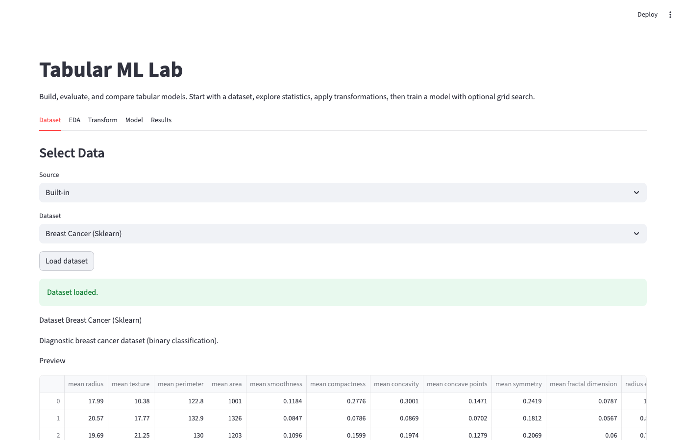
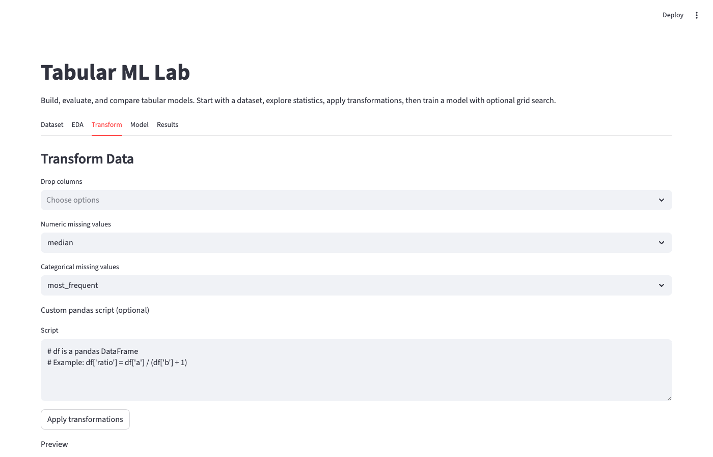
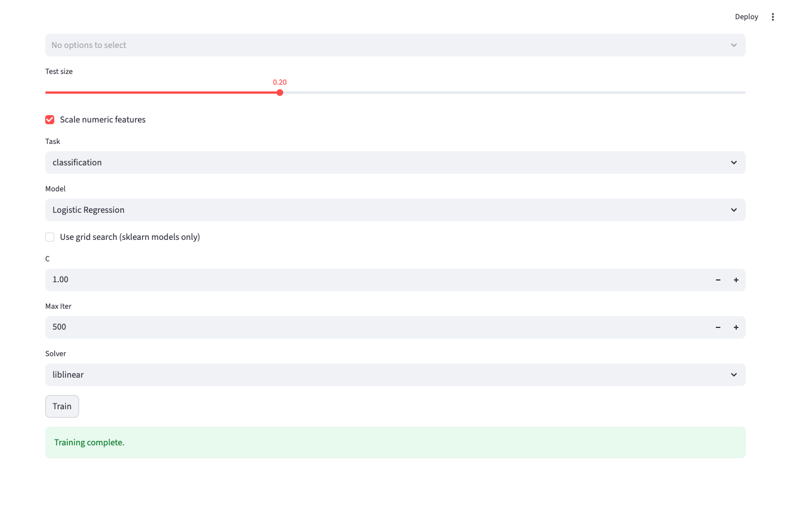
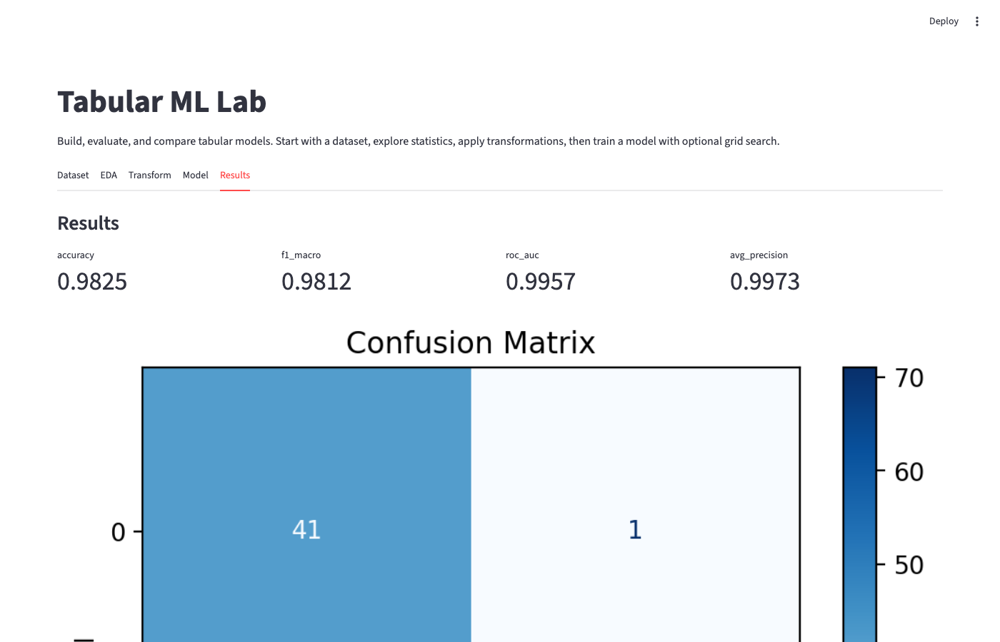

# Tabular ML Lab

Tabular ML pipeline: download data, run EDA, train a model, evaluate, serve an API, and launch a demo dashboard.

## Quickstart
```bash
python -m venv .venv
source .venv/bin/activate
pip install -r requirements.txt

python scripts/download_data.py
python scripts/eda.py
python scripts/train.py
python scripts/evaluate.py
```

## Serve the API
```bash
python scripts/serve.py
```

Example request:
```bash
curl -X POST http://localhost:8000/predict \
  -H "Content-Type: application/json" \
  -d '{
    "age": 39,
    "workclass": "State-gov",
    "fnlwgt": 77516,
    "education": "Bachelors",
    "education-num": 13,
    "marital-status": "Never-married",
    "occupation": "Adm-clerical",
    "relationship": "Not-in-family",
    "race": "White",
    "sex": "Male",
    "capital-gain": 2174,
    "capital-loss": 0,
    "hours-per-week": 40,
    "native-country": "United-States"
  }'
```

## Launch the Dashboard
```bash
python scripts/dashboard.py
```

## UI Walkthrough
1. Dataset: choose built-in/OpenML/CSV, select target, preview.

2. EDA: summary stats, distributions, relationships.

3. Transform: drop columns, handle missing values, run custom pandas.

4. Model: pick algorithm, set hyperparameters, optional grid search.

5. Results: metrics, plots, saved run and API sample.


## License
MIT
